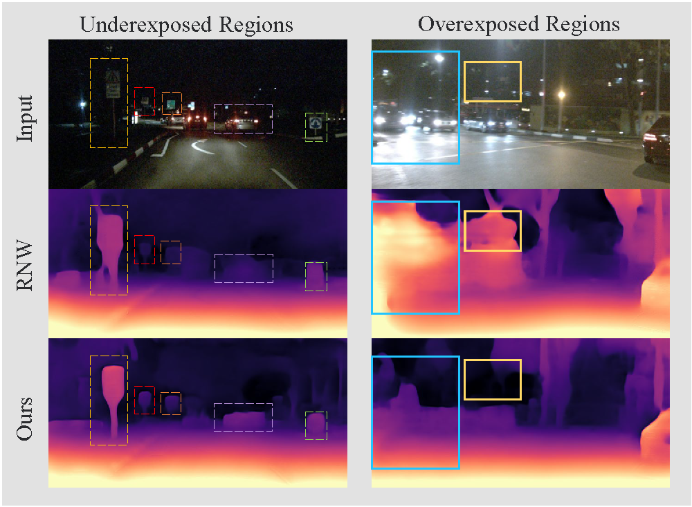

# STEPS: Joint Self-supervised Nighttime Image Enhancement and Depth Estimation (ICRA 2023)
Yupeng Zheng, Chengliang Zhong, Pengfei Li, Huan-ang Gao, Yuhang Zheng, Bu Jin, Ling Wang, Hao Zhao, Guyue Zhou, Qichao Zhang and Dongbin Zhao
Institute of Automation, Chinese Academy of Sciences; Institute for AI Industry Research (AIR), Tsinghua University

## Introduction

This is the official repository for *STEPS: Joint Self-supervised Nighttime Image Enhancement and Depth Estimation*. You can find our paper at [arxiv](https://arxiv.org/abs/). In this repository, we release the RobotCar-Night and nuScenes-Night dataset, as well as the code.



## Installation

1. Create conda environment:

```
$ conda create -n STEPS python=3.7
$ conda activate STEPS
```

2. This code was implemented with python 3.7, torch 1.8.0+cu111 and pytorch-lightning==1.6.4
```
$ pip install torch==1.8.0+cu111 torchvision==0.9.0 torchmetrics==0.9.0 -f https://download.pytorch.org/whl/torch_stable.html 
$ pip install pytorch-lightning==1.6.4
```

3. Install other dependency
```
$ pip install -r requirements.txt
```

## Dataset

For data preparation of RobotCar-Night and nuScenes-Night datasets, we follow The dataset used in "Regularizing Nighttime Weirdness: Efficient Self-supervised Monocular Depth Estimation in the Dark" |[pdf](https://arxiv.org/abs/2108.03830), [github](https://github.com/w2kun/RNW)|. Our work is based on [RobotCar](https://robotcar-dataset.robots.ox.ac.uk) and [nuScenes](https://www.nuscenes.org/nuscenes).  `(2014-12-16-18-44-24, 2014-12-09-13-21-02)` of RobotCar and `(Package 01, 02, 05, 09, 10)` of nuScenes is enough for running the code. You can use the above official toolboxes produce the ground truth depth. Or you can download our pre-processed groudtruth and denoised dataset from the following link.

|[dataset](https://drive.google.com/drive/folders/1n2WsaGtB-tRiPyee-vAYF6Cd7EZr4RGe)|


After preparing datasets, we strongly recommend you to organize the directory structure as follows. The split files are provided in `split_files/`.

```
STEPS
data
|__RobotCar-Night
   |__Package name (e.g. 2014-12-16-18-44-24)
      |__depth (to store the .npy ground truth depth maps)
         |__ground truth depth files
      |__rgb (to store the .png color images)
         |__color image files
      |__intrinsic.npy (to store the camera intrinsics)
      |__test_split.txt (to store the test samples)
      |__train_split.txt (to store the train samples)
   nuScenes-Night
   |__sequences (to store sequence data)
      |__video clip number (e.g. scene-1091)
         |__file_list.txt (to store the image file names in this video clip)
         |__intrinsic.npy (to store the camera intrinsic of this video clip)
         |__image files described in file_list.txt
   |__splits (to store split files)
      |__split files with name (day/night)_(train/test)_split.txt
   |__test
      |__color (to store color images for testing)
      |__gt (to store ground truth depth maps w.r.t color)
```

## Training
1. For the nuScenes-Night dataset, we recommend denoising first. We using AP-BSN |[pdf](https://arxiv.org/abs/2203.11799), [github](https://github.com/wooseoklee4/AP-BSN)| to preprocess both train and test dataset. Or you can download our pre-processed dataset from the above link
2. Train a self-supervised model on daytime data, by

   ```shell
   sh scripts/train_(rc/ns).sh
   ```
3. Change config name in train_(rc/ns).sh
4. Train STEPS by

   ```shell
   sh scripts/train_(rc/ns).sh
   ```

In default, checkpoints will be saved every two epochs.

## Testing
To test on RobotCar-Night or nuScenes-Night, you can run

```shell
sh scripts/test_(rc/ns).sh
```
## Pre-trained Models
For a quick test, you can download pretrained checkpoints of our method.

[checkpoints](https://drive.google.com/drive/folders/16bqgIYBDg4dd9eGFWYL6Cyp5xCs4-DbI)

1. Test on nuScenes(without denoising)
```shell
+---------------------------------------------------------------------------+
|                             Evaluation Result                             |
+---------------------------------------------------------------------------+
|  abs_rel  |  sq_rel  |   rmse  |  rmse_log  |    a1   |    a2   |    a3   |
+---------------------------------------------------------------------------+
|   0.303   |  3.522   |  9.201  |   0.390    |  0.551  |  0.791  |  0.901  |
+---------------------------------------------------------------------------+
```

2. Test on nuScenes(with denoising)
```shell
+---------------------------------------------------------------------------+
|                             Evaluation Result                             |
+---------------------------------------------------------------------------+
|  abs_rel  |  sq_rel  |   rmse  |  rmse_log  |    a1   |    a2   |    a3   |
+---------------------------------------------------------------------------+
|   0.292   |  3.371   |  9.126  |   0.382    |  0.572  |  0.805  |  0.908  |
+---------------------------------------------------------------------------+
```

3. Test on RobotCar
```shell
+---------------------------------------------------------------------------+
|                             Evaluation Result                             |
+---------------------------------------------------------------------------+
|  abs_rel  |  sq_rel  |   rmse  |  rmse_log  |    a1   |    a2   |    a3   |
+---------------------------------------------------------------------------+
|   0.170   |  1.686   |  6.797  |   0.234    |  0.758  |  0.923  |  0.968  |
+---------------------------------------------------------------------------+
```